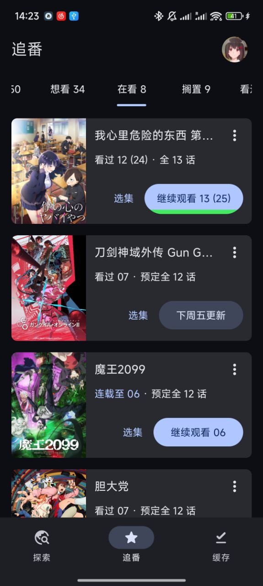
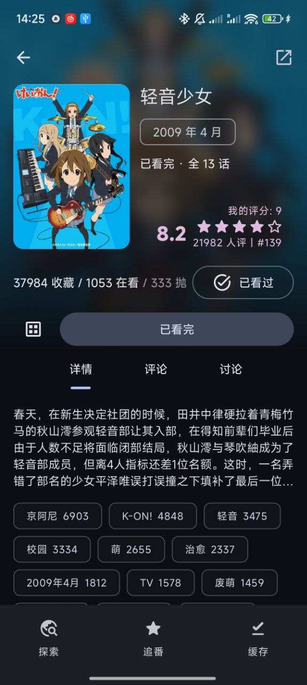
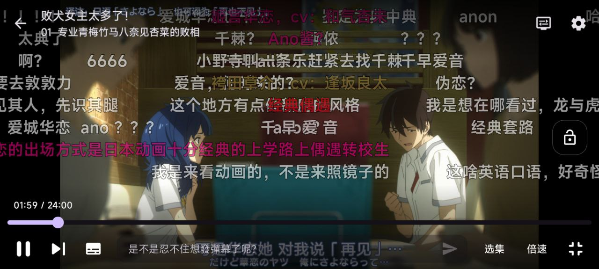
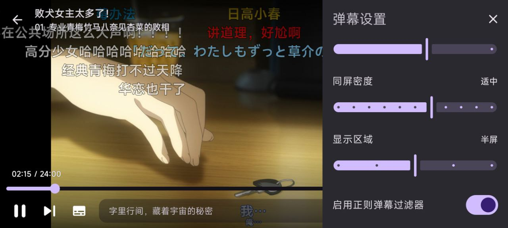
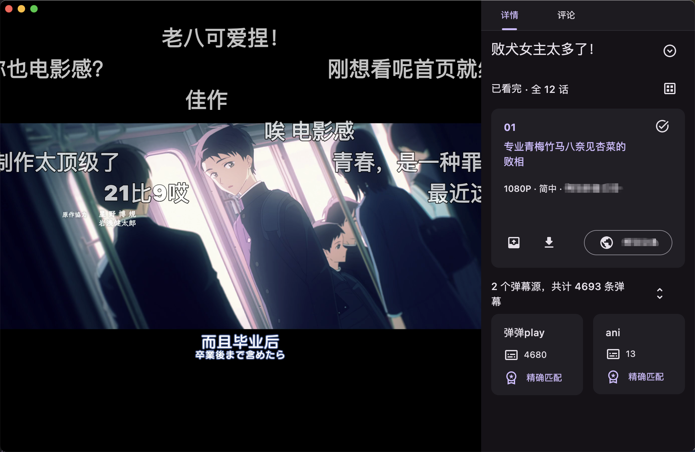
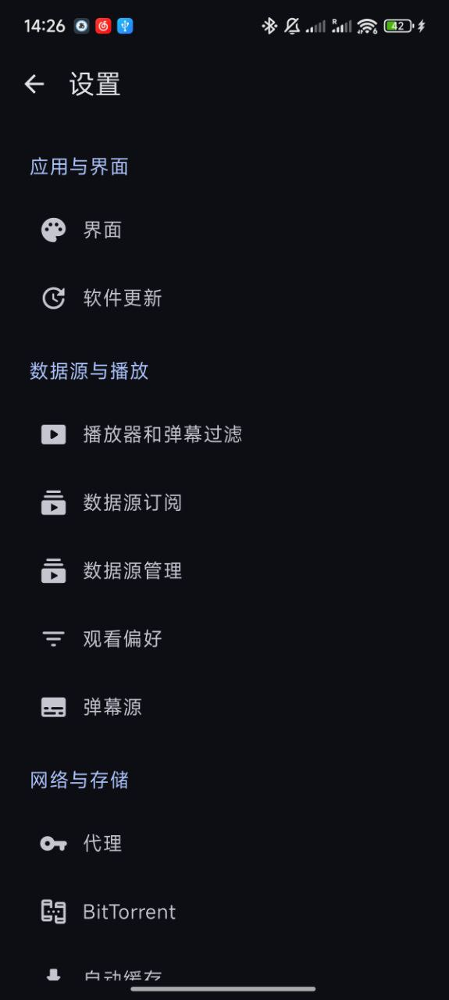
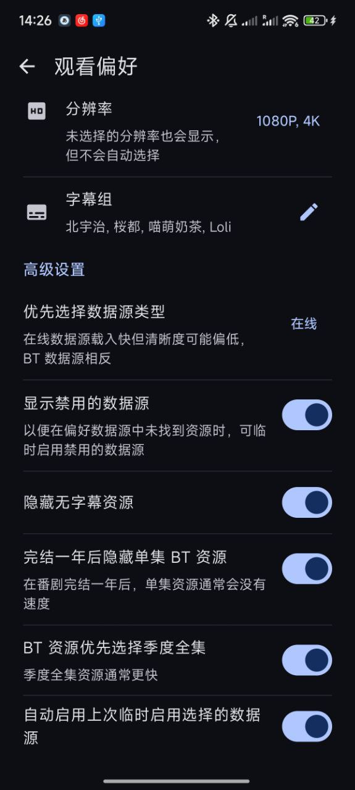
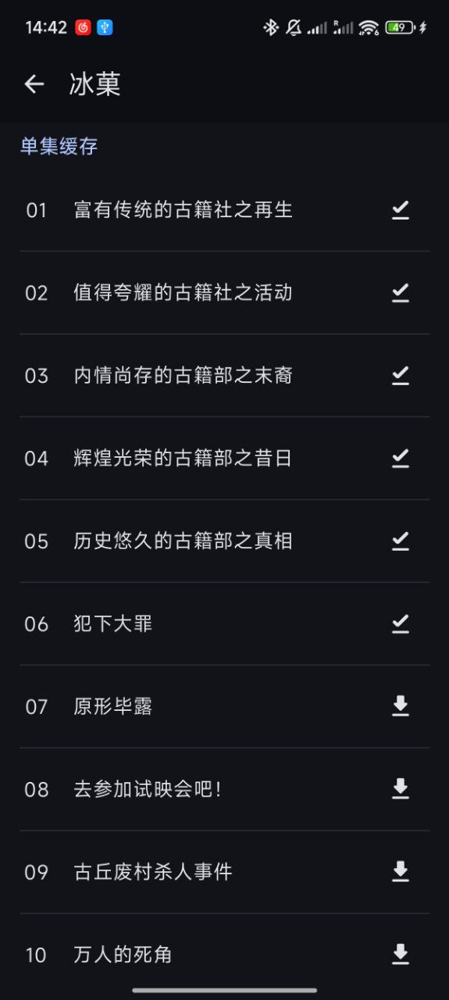
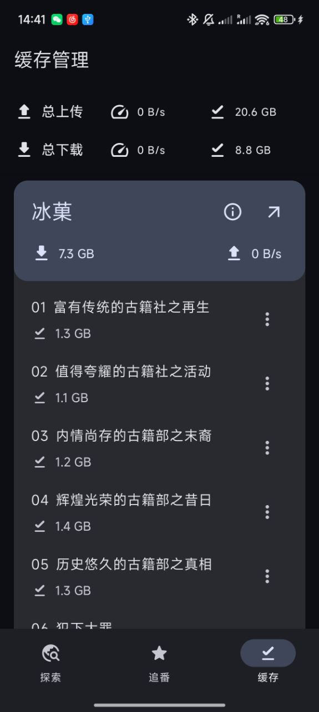

| 下載量                                                                                                                                                                                                                | 正式版↓                                                                                                                                                                         | 测试版↓                                                                                                                                                                                    | 讨论群                                                                                                                                                                                                                                                                                                                                                                                                           |
|--------------------------------------------------------------------------------------------------------------------------------------------------------------------------------------------------------------------|------------------------------------------------------------------------------------------------------------------------------------------------------------------------------|-----------------------------------------------------------------------------------------------------------------------------------------------------------------------------------------|---------------------------------------------------------------------------------------------------------------------------------------------------------------------------------------------------------------------------------------------------------------------------------------------------------------------------------------------------------------------------------------------------------------|
|  |  |  |   |

[dmhy]: http://www.dmhy.org/

[Bangumi]: http://bangumi.tv

[ddplay]: https://www.dandanplay.com/

[Compose Multiplatform]: https://www.jetbrains.com/compose-multiplatform/

[acg.rip]: https://acg.rip

[Mikan]: https://mikanani.me/

[Ikaros]: https://ikaros.run/

[Kotlin Multiplatform]: https://kotlinlang.org/docs/multiplatform.html

[ExoPlayer]: https://developer.android.com/media/media3/exoplayer

[VLC]: https://www.videolan.org/vlc/

[libtorrent]: https://libtorrent.org/

Animeko 支持云同步观看记录 ([Bangumi][Bangumi])、多视频数据源、缓存、弹幕、以及更多功能，提供尽可能简单且舒适的追番体验。

## 技术总览

以下几点可以给你一个技术上的大概了解，不感兴趣的可以直接看[截图](#功能截图)。

- [Kotlin 多平台][Kotlin Multiplatform]架构，支持 Windows、macOS、Android 和 iOS (计划)
- 基于 Kotlin 多平台架构，使用新一代响应式 UI 框架 [Compose Multiplatform][Compose Multiplatform] 构建
  UI
- 内置专为 Animeko 打造的基于 [libtorrent][libtorrent] 的 BitTorrent 引擎，优化边下边播的体验
- 高性能弹幕引擎，公益弹幕服务器 + 网络弹幕源
- 适配多平台的视频播放器，Android 底层为 [ExoPlayer][ExoPlayer]，PC 底层为 [VLC][VLC]
- 多类型数据源适配，内置 [动漫花园][dmhy]， [Mikan]，拥有强大的自定义数据源编辑器

### 参与开发

欢迎你提交 PR 参与开发，
有关项目技术细节请参考 [CONTRIBUTING](docs/contributing/README.md)。

## 下载

Animeko 支持 Android 和桌面端 (macOS、Windows)。

- 稳定版本: 每两周更新, 功能稳定  
  [下载稳定版本](https://github.com/Him188/ani/releases/latest)

通常建议使用稳定版本. 如果你愿意参与测试并拥有一定的对 bug 的处理能力, 也欢迎使用测试版本更快体验新功能.
具体版本类型可查看下方.

- 测试版本: 每两天更新, 体验最新功能  
  [下载测试版本](https://github.com/Him188/ani/releases)

 <b>点击查看具体版本类型</b> 

Animeko 采用语义化版本号, 简单来说就是 `4.x.y` 的格式. 有以下几种版本类型:

- 稳定版本:
    - **新特性发布**: 当 `x` 更新时, 会有新特性的发布. 通常为 2 周一次.
    - **Bug 修复**: 当 `y` 更新时, 只会有针对前个版本的重要的 bug 修复. 这些 Bug 修复版本穿插在新特性更新的间隔中,
      时间不固定.
- 在稳定版本的发布周期之间, 会发布测试版本:
    - **Alpha 测试版**: 所有重大新功能都会首先发布到 `alpha` 测试通道, 客户端内可使用 "每日构建"
      接收更新. 这些新功能非常不稳定, 适合热情的先锋测试员!
    - **Beta 测试版**: 在功能经过 alpha 测试修复重大问题后, 会进入 `beta` 测试通道,
      在客户端内名称为 "测试版". 此版本仍然不稳定, 是一个平衡新功能和稳定性的选择

## 功能截图

### 管理追番

- 多端同步 [Bangumi][Bangumi] 收藏, 记录观看进度

  

### 多数据源聚合

总有一个源有你想看的番和喜欢的字幕组

- 全自动整合多个 BT 数据源与在线数据源, 兼顾资源质量与速度
- 智能选择算法避免找资源的麻烦

   

### 视频弹幕

- 多弹幕数据源
- 高效弹幕引擎, 自定义样式
- 发送弹幕到 Animeko 公益弹幕服务器

### 高度自定义

- 设置全局优先选择的字幕组, 字幕语言等设置
- 在观看时修改过滤可自动记忆并应用到下次播放和自动缓存

   

### 缓存

- 支持离线播放

  

### 完全免费无广告且开放源代码

- 使用靠谱的 [Bangumi][Bangumi] 记录追番数据, 不怕网站跑路丢失数据
- 视频播放使用 P2P 资源, 无服务器维护成本, ~即使我跑路了 Animeko 也能用~
- 开放源代码, 公开自动构建, 无资料泄露风险
- 可 PR 添加自己喜欢的功能

## FAQ

### 资源来源是什么?

全部视频数据都来自网络, Animeko 本身不存储任何视频数据。
Animeko 支持两大数据源类型：BT 和在线。BT 源即为公共 BitTorrent P2P 网络，
每个在 BT
网络上的人都可分享自己拥有的资源供他人下载。在线源即为其他视频资源网站分享的内容。Animeko
本身并不提供任何视频资源。

本着互助精神，使用 BT 源时 Animeko 会自动做种 (分享数据)。
BT 指纹为 `-AL4123-`，其中 `4123` 为版本号 `4.12.3`；UA 为类似 `ani_libtorrent/4.12.3`。

### 弹幕来源是什么?

Animeko 拥有自己的公益弹幕服务器，在 Animeko 应用内发送的弹幕将会发送到弹幕服务器上。每条弹幕都会以
Bangumi
用户名绑定以防滥用（并考虑未来增加举报和屏蔽功能）。

Animeko 还会从[弹弹play][ddplay]获取关联弹幕，弹弹play还会从其他弹幕平台例如哔哩哔哩港澳台和巴哈姆特获取弹幕。
番剧每集可拥有几十到几千条不等的弹幕量。
