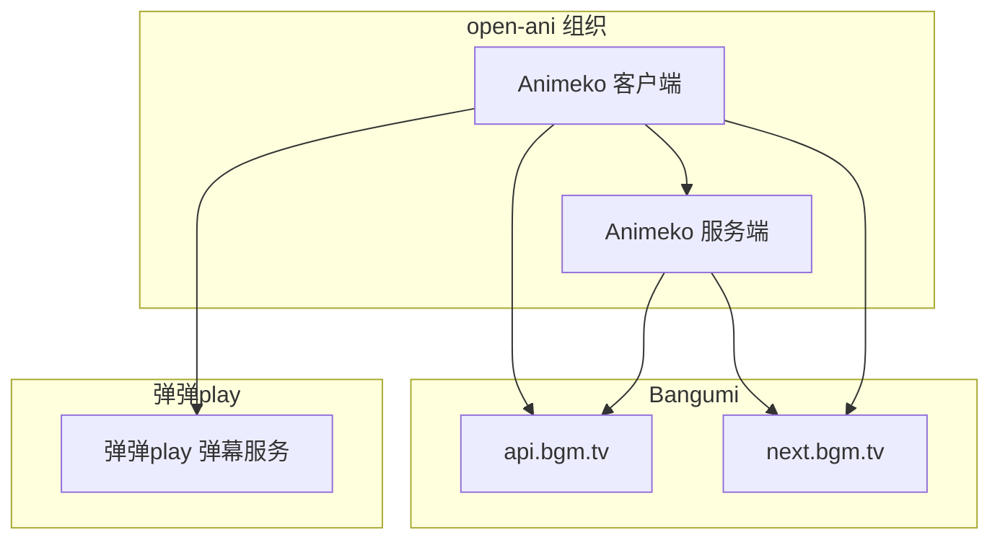
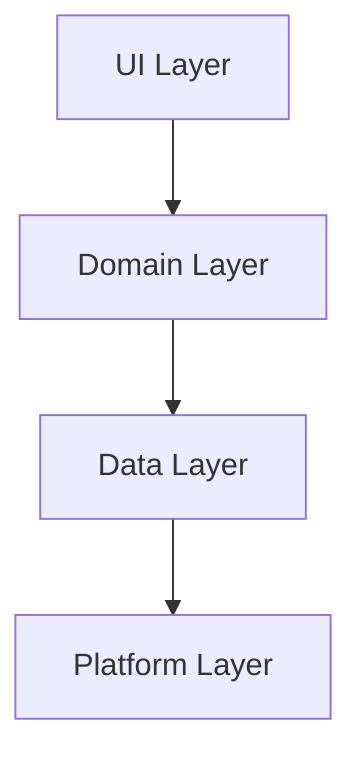
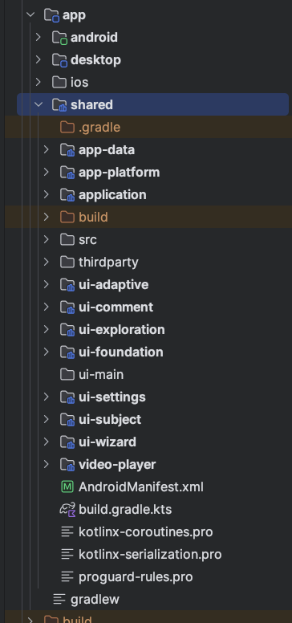

# 项目总体架构

Animeko (简称 Ani) 现在已经是一个不小的项目，本章节将给你一个全面的了解。

## 项目关系

Ani 不只是一个客户端，还涉及弹幕服务端，Bangumi 服务等依赖。
**此文章随后只关注 Ani 客户端部分**，不过了解相关服务关系仍然可以为你提供帮助：

[gh-animeko]: https://github.com/open-ani/animeko

[gh-ani-api-server]: https://github.com/open-ani/ani-api-server

[gh-bangumi-api]: https://github.com/bangumi/api

[bangumi]: https://bgm.tv

[bangumi-next]: https://next.bgm.tv

[ddplay]: https://www.dandanplay.com/

[Mediamp]: https://github.com/open-ani/mediamp

[anitorrent]: https://github.com/open-ani/anitorrent

| 名称           | 仓库/主页地址                                  | 说明                                               |
|--------------|------------------------------------------|--------------------------------------------------|
| Animeko 客户端  | 当前                                       | Android/iOS/PC 客户端统一仓库                           |
| Animeko 服务端  | [GitHub][gh-ani-api-server]              | Ani 弹幕服务<br>Bangumi 最高热度排行榜等缓存服务<br>新番时间表等高级索引服务 |
| 弹弹play       | [主站][ddplay]                             | 弹弹play 弹幕服务                                      |
| Bangumi      | [GitHub][gh-bangumi-api] / [主站][bangumi] | 提供番剧详情、剧集信息、评论等信息功能; Bangumi OAuth               |
| Bangumi Next | [主站][bangumi-next]                       | 提供一些专用接口用来查询 Bangumi 的一些信息                       |

依赖关系如下图所示。其中箭头 `A -> B` 表示 A 依赖 B.



一些关键点:

- Ani 客户端依赖上述所有服务；
- Ani 服务端为 Bangumi OAuth 的中转站。用户想要登录客户端，须先经过 Ani 服务端协调，用户在浏览器登录完成后由
  Ani 服务端处理回调信息；
- Ani 服务端也依赖 Bangumi 服务，通常是用来获取信息并处理后缓存起来，加快客户端查询速度并减少对
  Bangumi 服务的压力。对于客户端需要进行大量查询的操作应当优先在 Ani 服务端实现并缓存；
- 有两个弹幕服务。客户端内查询弹幕时会同时查询两个服务，并合并结果。客户端内发送的弹幕只会发送到 Ani
  弹幕服务.

# 客户端部分

本章节将从大到小讲述 Ani 客户端 (本 GitHub 仓库) 的架构。

我们会先从[仓库结构](#仓库结构) 了解仓库内有哪些模块及其作用，然后进入最重要的 APP
模块了解 [APP 架构](#APP-架构)，随后按照架构的每一层级深入了解各个模块的作用。

本章节会假设你熟悉一些 Kotlin 多平台技术。如果你不熟悉，可以先阅读[这里](kmp.md)。

## 仓库结构

Ani 使用 Gradle 构建系统。Gradle 构建系统由多个模块 (module) 组成，每个模块都有自己的功能和职责。

Ani 客户端大致包含 30 个模块。我们可以把它们分成以下几个类别，这也对应了仓库内的目录结构：

- `utils`：基础工具模块，包含日志库、序列化、BBCode 等基础工具
- `datasource`：数据源
    - `api`：通用数据源接口
    - `bangumi`：Bangumi 数据源
    - `ikaros`、`jellyfin`、`bt/mikan`、...：各数据源实现
- `client`：封装 Ani 服务端的接口
- `danmaku`：弹幕功能
    - `dandanplay`：弹弹 play 弹幕服务
    - `ui`：弹幕引擎以及视频播放器上的弹幕层 UI
- `torrent`：BitTorrent 模块，接入 [anitorrent][anitorrent]
- `app`
    - `shared`：全平台共享代码，包括全部 UI 代码和业务逻辑等
    - `android`，`desktop`，`ios`：各个平台的入口模块，用于打包 apk/exe/dmg

可以看到，app/shared 是存放绝大部分代码的地方，也是最重要的模块，下文会详细解释。其他模块比较简单，基于名称就能了解其作用，不再赘述。

## APP 架构

我们将详细了解 app/shared 模块内部的架构.

[android-commended-arch]: https://developer.android.com/topic/architecture#recommended-app-arch

APP 采用[安卓官方推荐架构][android-commended-arch]，即 UI 到 Domain 到 Data 的分层架构，并依照多平台目标增加了平台层：



UI 层负责展示数据，Domain 层负责业务逻辑，Data 层负责数据的获取和存储，Platform 层负责适配不同平台的基础需求。

在 Ani 中，`shared` 模块内部依照该层级关系拆解为：

 

- `app-platform`：平台层。用于适配不同平台的基础需求。包含 BuildConfig、权限管理、音量控制器等。
  > **平台**：即 APP 支持的操作系统。例如 Android，macOS，Windows，iOS。
- `app-data`：数据层与业务层。由于一些历史遗留原因，该模块内部同时有数据层和业务层的代码，
  不过在不同包名下：
    - `src/commonMain/data`：数据层，包含数据库持久化，网络处理。
    - `src/commonMain/domain`：业务层，包含各个功能的业务逻辑，处理数据源的数据。
- `ui-*`：UI 层。用于展示数据，与用户交互。按功能拆分为多个模块，但它们都拥有名称前缀 `ui-`。

下面将浅要介绍各层的功能。如果你已经熟悉安卓官方推荐架构，可以跳过。

### 数据层 (Data)

数据层负责数据的获取和存储。它会执行网络请求，管理本地缓存，并暴露数据模型 `data class` 和数据仓库
`Repository` 给业务层使用。

在 Ani 中，数据层主要包含以下几个部分（在
`app/shared/app-data/src/commonMain/data` 中）：

[Room]: https://developer.android.com/training/data-storage/room

[datastore]: https://developer.android.com/topic/libraries/architecture/datastore

- `models`：数据模型。即番剧信息、剧集信息、用户信息等的 `data class`。也会被 Domain 层使用。
- `persistent`：持久化
    - `datastore`：[Data Store][datastore] 数据存储。相当于把数据序列化成 JSON 和 ProtoBuf
      后存储到一个文件内。一些非常简单的配置信息会使用这种方式存储。
    - `database`：[Room][Room] SQLite 数据库。用于存储番剧信息缓存、用户收藏信息缓存、观看记录等。
- `network`：网络请求。例如 `BangumiSubjectService` 用于执行 HTTP 请求，获取 Bangumi
  番剧信息。
- `repository`：数据仓库。每个数据仓库协调网络层提供的 service 和持久层的数据库，管理一类数据的获取和存储。
  例如，`SubjectCollectionRepository` 负责结合 network 层的 `BangumiSubjectService` 和 database 层的
  `SubjectCollectionDao`，在获取数据时自动缓存网络请求结果到数据库。

### 业务层 (Domain)

业务层负责业务逻辑。

业务层会使用数据层提供的数据模型和数据仓库，处理数据，暴露特定业务的专业处理器和 UseCase 给 UI 层使用。例如：

- Ani 支持查询多个数据源，获取查询进度、重启查询、取消查询等功能。业务层封装 `MediaFetcher` 来实现这些功能。
- Ani 支持结合连载情况和季度信息自动过滤资源、按照用户偏好设置自动排序资源、分多个阶段的自动选择等复杂功能。业务层封装数据源选择器
  `MediaSelector` 来处理这些逻辑。
- Ani 的播放功能多样。支持自动保存播放进度、自动选择数据源、自动切换数据源、加载弹幕等功能。每个功能都分别有一个处理器负责，业务层又提供
  `EpisodeFetchSelectPlayState` 完成这些子功能的组装。

这些处理器都与 UI 无关，且不会绑定到特定的数据来源（不直接依赖网络服务而是依赖抽象的 `Repository`
接口）。它们通常拥有全面的单元测试。

我们无法一一列举所有业务逻辑。
`app/shared/app-data/src/commonMain/domain` 内按照对应的业务类型拆分为多个包，例如
`player`、`media`、
`settings` 等。请参考源代码以了解具体现有业务有哪些。

> [!TIP]
> **如何快速定位你想修改的业务逻辑**
>
> 从 UI 入手。全局搜索 UI 页面上的关键字，根据调用关系找到对应的 ViewModel，进而找到对应业务逻辑。

这里我们解答一些团队内的规范：

- [UseCase 的使用](#UseCase-的使用)

#### UseCase 的使用

Ani 使用 UseCase 设计（参考安卓官方推荐）。对于同一个业务场景的重复操作，可以封装为一个
UseCase 来减少重复。

但 UseCase 封装不是必须的。如果功能非常简单，你可以在 UI 的 state holder（例如 ViewModel）中直接调用
Repository，而无需经过 UseCase。这非常适合一些简单的 CRUD 操作：

```kotlin
class MyViewModel(
    private val subjectId: Int,
) : AbstractViewModel(), KoinComponent {
    private val episodeCollectionRepository: EpisodeCollectionRepository by inject()

    fun setAllEpisodesWatched() {
        viewModelScope.launch {
            // GOOD
            episodeCollectionRepository.setAllEpisodesWatched(subjectId)
        }
    }
}
```

复杂操作必须在 Domain 层封装一个对象或者 UseCase。UI 不允许进行复杂数据操作。

### UI 层

UI 层负责展示数据，与用户交互。它只会跟 Domain 层接触，不会直接访问 Data 层。

[JC]: https://developer.android.com/jetpack/compose

[CMP]: https://www.jetbrains.com/compose-multiplatform/

Ani UI 100% 使用 [Compose Multiplatform][CMP]（CMP）编写。
> CMP 是 JetBrains 开发的，基于 Android
[Jetpack Compose][JC] 的多平台 UI 框架，支持 iOS、PC 等平台，用法与 Jetpack Compose 几乎一样。

前文已经说过，Ani 的 UI 代码按业务类型划分为一些名为 `ui-*` 的模块。
我们列举一些关键 UI 模块（以实际源码为准，这个列表不会及时更新）：

- `ui-foundation`：基础 UI 组件。包含主题、错误处理、基础控件等
- `ui-adaptive`：自适应布局的支持
- `ui-comment`：评论功能
- `ui-settings`：设置页
- `ui-subject`：条目（番剧）详情页、剧集详情页（播放页）、评分
- `ui-wizard`：新用户引导页
- `ui-exploration`：首页的探索分区。包含“最高热度”、“新番时间表”、“继续观看”栏目
- `video-player`：播放器的控制器 UI
- 特别地，弹幕功能位于 `:danmaku:ui` 模块内，而非 `:app:shared`
- 其余的功能都在 `app/shared/src` 中。这是历史遗留，以后会全部拆分为单独的 `ui-*` 模块

有关 UI
层的最佳实践，请参考 [Jetcaster](https://github.com/android/compose-samples/tree/main/Jetcaster)。

由于历史遗留原因，Ani 项目内留有许多不好的实践，但新编写的代码遵循最佳实践。所以，如果你想查看 Ani
中的最佳实践，可以阅读 `ui-exploration` 和 `ui-wizard`。

[//]: # (对于每个页面，我们会有一个 composable 函数实现页面的布局，一个 ui state class 用于管理页面的状态，一个)

[//]: # (view model 用于桥接业务层和 ui state。)

## 组件项目

我们将 Ani 的部分组件独立为单独的项目开发，并采用宽松的 Apache 2.0 协议开源 (相对于 Ani 的 AGPL
协议)。如果你需要修改相关功能，请查看以下项目:

- [Mediamp][Mediamp]: 多媒体播放器库，用于播放音频和视频。
  注意，Mediamp 只包含播放器内核实现。播放器 UI 和控制部分仍然在 Ani 客户端 (当前) 项目中。

- [anitorrent][anitorrent]: 封装 libtorrent 的 BitTorrent 引擎，用于下载番剧。
  Anitorrent 只提供低级 API。具体的 BT piece 控制、下载任务管理、缓存管理等功能仍然在 Ani 客户端 (
  当前) 项目中。
