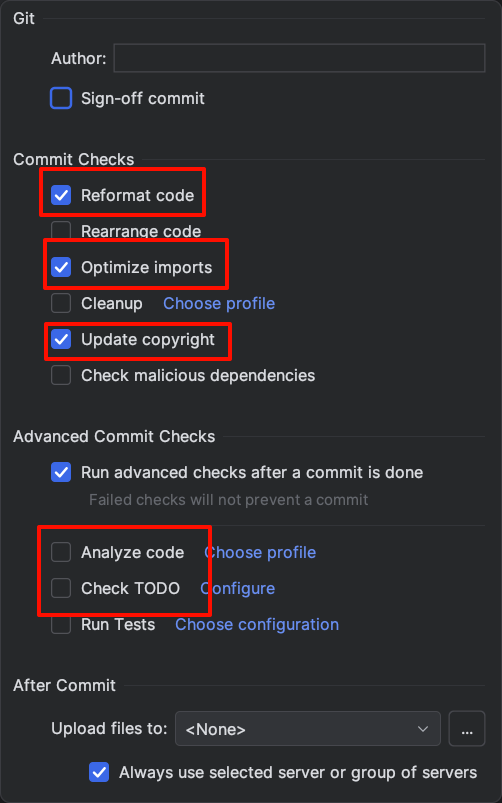

# 代码风格与代码规范

## 格式化

建议在 IDE 的 Commit 页面，点击右下角设置，按如图所示配置。
在提交时将会自动格式化代码并更新 copyright 年份。

> [!IMPORTANT]
> 确保 IDE 设置中 `Editor -> Code Style -> Enable EditorConfig support` 是勾选的。

## 代码规范

我们力求打造一个高质量的项目。

为了达成这一点：

- 请遵循 [Kotlin 官方代码风格指南](https://kotlinlang.org/docs/coding-conventions.html)
- 请为新功能增加单元测试
- 请为新功能增加 UI 测试 (如何编写测试将在下面说明)
- PR 审核将会比较严格。在保证项目代码质量的同时,，我们也希望尽可能地帮助你提高技术水平。
  审核者技术有限，如有意见不统一的情况，请务必提出，相互学习 :)
- 有关代码审查的最佳实践，可参考
  Google [The Standard of Code Review](https://google.github.io/eng-practices/review/reviewer/standard.html)
