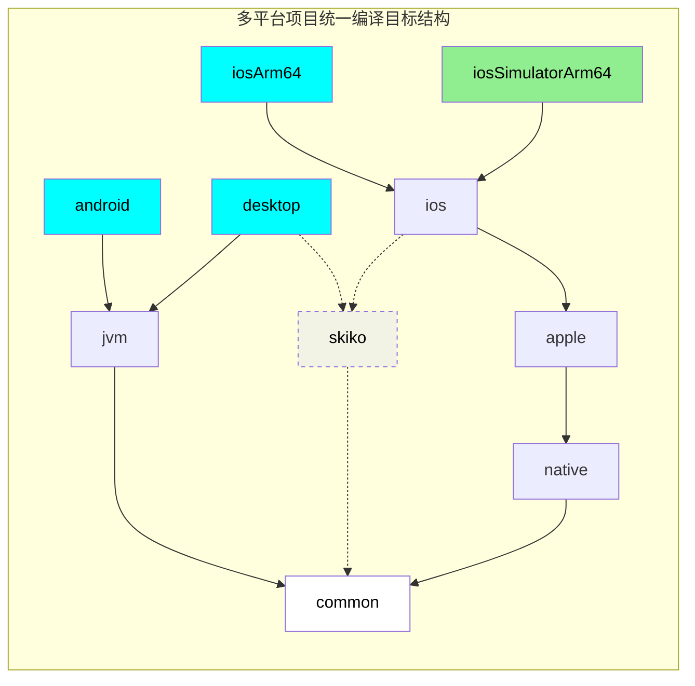

## Kotlin 多平台

Animeko 客户端 基于 Kotlin 多平台技术，目前正式支持 Android、桌面 JVM（macOS、Windows）共三个实际平台。
代码库中有正在开发中的
iOS 代码，但还没有配置构建 iOS APP。

### 什么是 Kotlin 多平台

[KMP]: https://kotlinlang.org/docs/multiplatform-discover-project.html

[Kotlin 多平台][KMP] (Kotlin Multiplatform，简称 KMP、MPP)，是 Kotlin 的多平台代码共享技术.
一个项目可以拥有多个编译目标平台，例如桌面 JVM、 Android、iOS。

每个目标平台由多个源集组成。源集可以理解为存放 `.kt` 代码文件的目录。
名称为 `common` 的源集的代码通常放置在 `src/commonMain/kotlin` (生产代码) 和
`src/commonTest/kotlin` (测试代码)。

`common` 源集为全平台共享的通用代码，多个目标之间能以任意程度共享代码.
例如，`android` 和 `desktop` 可以共同继承于一个 `jvm` 源集，在 `jvm` 源集中的代码就可以共享给安卓和桌面平台;
同时 `ios` 和 `desktop` 还可以共同继承于一个 `skiko` 源集 (因为这两个平台上的 UI 都是用 Skiko
渲染的)。

共享源集内，可以使用各个平台的专有 API。例如安卓和桌面都是 JVM，也就都可以使用 JDK (Java) API.
在 iOS 源集内，则可使用 native API，例如 UIKit。在 iOS 上，Kotlin 还支持 C/Objective-C 交互.

### 多平台编译目标结构

Ani 项目的几乎所有模块都使用 KMP。编译目标结构如下:

图例:

- 蓝色 (android，desktop，iosArm64) 为最终目标。它们将会构建成为 APP；
- 绿色的 (iosSimulatorArm64) 是 iOS 模拟器目标，仅为运行测试；
- `A -> B` 表示 A 依赖 B。实线表示主要路径，虚线表示辅助路径。

[Skiko]: https://github.com/JetBrains/skiko

Compose Multiplatform 在 `desktop` 和 `ios` 均使用 [Skiko][Skiko] 渲染，因此我们增加一个共享源集命名为
`skiko`。
中间源集 `skiko` 为辅助作用。主要的平台适配代码仍然在 `jvm` 和 `apple` 中。

### 编译时会发生什么

- `common` 内放置可同时在两个平台跑的代码, `android` 内放置只能在 Android 平台跑的代码，`desktop`
  内放置只能在桌面 JVM 平台跑的代码；
- `android` 内，可以访问 `common` 内的代码，还可以访问 Android SDK 例如 `Activity`；
- 在 `common` 内，不能访问 Android SDK, 也不能使用 Java Swing 等 Android 上不支持的功能；
- 编译 `android` 时，Kotlin 会合并 `common` 与 `android` 的代码一起编译。

### 如何增加多平台功能

在 `common` 内可以使用 `expect fun` 定义一个没有函数体的函数，然后在 `android` 或 `desktop` 内使用
`actual fun` 实现它，这样就可以在 `common` 内间接访问到平台相关的功能。

要开发一个适配各个平台的功能的流程通常是如下所示。

以增加视频播放器为例:

1. 在 `commonMain` 中增加 `expect fun VideoPlayer(state: MediampPlayer)`。该函数没有函数体,
   各个平台分别实现函数体；
2. 考虑该功能应当如何在各个平台实现。对于视频播放器，我们需要在三个平台分别实现；
3. 在 `androidMain`、`desktopMain`、`appleMain` 中分别增加
   `actual fun VideoPlayer(state: MediampPlayer) { ... }`，并完成具体实现。

这样，就可以在 `commonMain` 中调用 `VideoPlayer` 函数，而在编译时 Kotlin 自动选择正确的实现。

> [!TIP]
> 如果有一些功能只有一个平台需要——例如 PC 上的隐藏鼠标指针功能——你仍然需要为所有平台提供实现，
> 将函数体留空即可。
